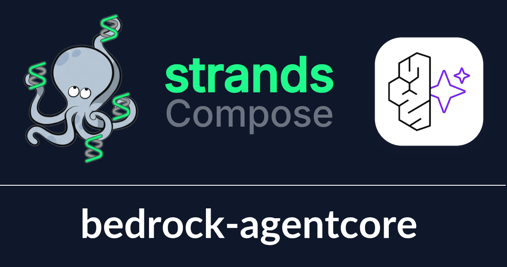
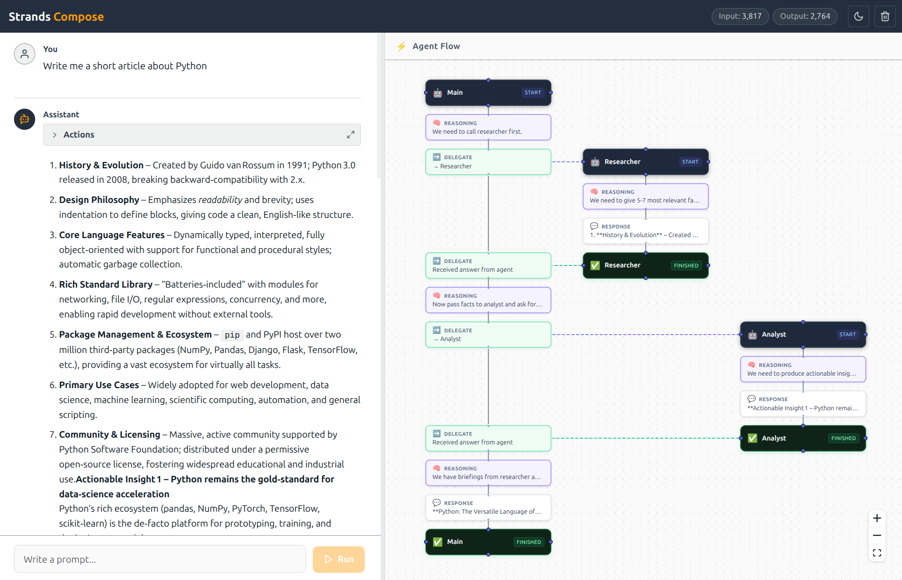

<div align="center">
  

  # Strands Compose

  **Build AI agent systems — not boilerplate**

  <p>
    <a href="https://www.python.org/"></a>
    <a href="https://pypi.org/project/strands-compose/"></a>
    <a href="https://github.com/strands-agents/sdk-python"></a>
    <a href="https://github.com/strands-compose/sdk-python/blob/main/LICENSE"></a>
  </p>
</div>

> [!IMPORTANT]
> Community project — not affiliated with AWS or the strands-agents team.

---

## What is this?

> **Think Docker Compose, but for AI agents**

[Strands](https://github.com/strands-agents/sdk-python) is a powerful agent SDK. Building multi-agent systems with it means writing the same wiring code over and over — models, MCP servers, hooks, orchestration topology. **Strands-compose kills that boilerplate**: describe your entire agent system in YAML, call `load()`, and get back plain, fully-wired strands objects. No wrappers. No magic. The real deal.

```yaml
models:
  default:
    provider: bedrock
    model_id: us.anthropic.claude-sonnet-4-6-v1:0

agents:
  researcher:
    model: default
    system_prompt: "You research topics."
  writer:
    model: default
    system_prompt: "You write reports."
  coordinator:
    model: default
    system_prompt: "Coordinate the team."

orchestrations:
  team:
    mode: delegate
    entry_name: coordinator
    connections:
      - agent: researcher
        description: "Research a topic."
      - agent: writer
        description: "Write the report."

entry: team
```

```python
from strands_compose import load

result = load("config.yaml").entry("Write a report on quantum computing.")
print(result)
```

Three agents, full orchestration, shared model — **zero plumbing code**.

---

## Repositories

### 🧱 Core package — [`sdk-python`](https://github.com/strands-compose/sdk-python)

The heart of the organization. Everything else builds on top of it.

| | |
|---|---|
| **YAML-first config** | Models, agents, tools, hooks, MCP, orchestrations — one file |
| **YAML superpowers** | Variables (`${VAR:-default}`), anchors, `x-` scratch pads, multi-file merge |
| **Multi-model** | Bedrock, OpenAI, Ollama, Gemini — swap with one line |
| **Orchestration modes** | Delegate, Swarm, Graph — arbitrarily nestable |
| **MCP lifecycle** | Local servers, remote HTTP, stdio — startup, polling, graceful shutdown |
| **Session persistence** | File, S3, or Bedrock AgentCore Memory |
| **Event streaming** | Unified async queue — tokens, tool calls, handoffs, completions |

→ **[View repo](https://github.com/strands-compose/sdk-python)** · [PyPI](https://pypi.org/project/strands-compose/) · [Examples](https://github.com/strands-compose/sdk-python/tree/main/examples)

---

## Coming Soon

### 🚀 `bedrock-agentcore`

The same `config.yaml` you develop with locally goes straight to production on **AWS Bedrock AgentCore** — no refactoring, no new abstractions. The `bedrock-agentcore` package takes care of packaging and deploying your entire agent system: models, tools, MCP servers, orchestration topology — all of it. One CLI command and your agents are running on fully managed AWS infrastructure with auto-scaling, high availability, and lifecycle management handled for you. Build locally with strands-compose, ship globally with AgentCore.



---

### 💬 `chat-ui`

A ready-to-use chat frontend that connects to a **strands-compose server**. Point it at your server URL, and get a streaming chat panel with a live **Agent Flow graph** — watch every reasoning step, delegation, and agent completion render in real time as your system runs.



---

> Want to stay in the loop? **Watch this org** or ⭐ [sdk-python](https://github.com/strands-compose/sdk-python) for updates.
